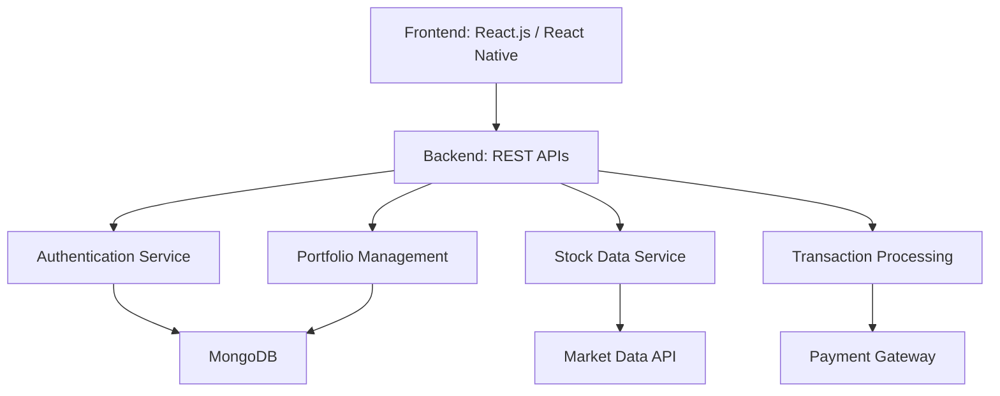
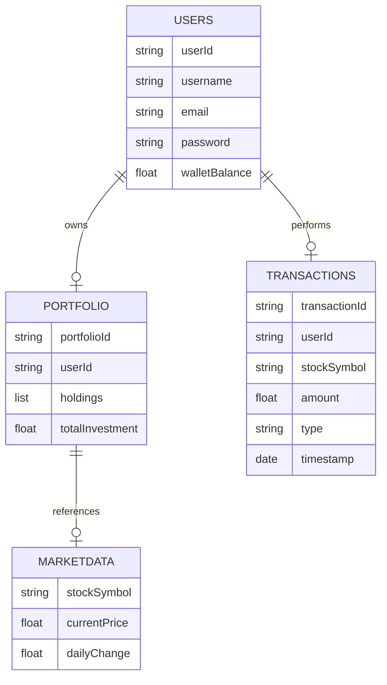

# **Groww Competitor Investment Platform - Software Design Document (SDD)**

## **1. Introduction**

### 1.1 **Purpose**
This document describes the design architecture for the Groww Competitor platform, an investment management system for stocks, mutual funds, and portfolios. It defines the system components, data flow, and deployment strategies.

### 1.2 **Scope**
The Groww Competitor platform enables:
- Real-time stock and fund tracking
- Portfolio management
- Secure financial transactions
- Analytical insights for investments

### 1.3 **Goals & Principles**
- **Scalability**: Handle large datasets and users efficiently  
- **Performance**: Real-time stock updates with minimal latency  
- **Security**: End-to-end encryption for transactions  
- **Modularity**: Independent and maintainable microservices  
- **User Focus**: Seamless and intuitive interface  

## **2. System Overview**

The system leverages **microservices architecture** to deliver scalable and modular financial management:

- **Frontend**: User interface (Web & Mobile)  
- **Backend**: REST APIs and business logic  
- **Database**: Data storage for users, portfolios, and transactions  
- **Integrations**: External APIs for stock data and payment processing  

---

## **3. System Architecture**

### **3.1 High-Level Architecture**  

### **3.2 Components**

#### **Frontend**  
- **Tech Stack**: React.js (Web), React Native (Mobile)  
- **Features**:  
  - Authentication (Login, Registration)  
  - Portfolio Dashboard  
  - Real-time stock data visualization  

#### **Backend (Microservices)**  
1. **Authentication Service**: User registration and login  
2. **Stock Data Service**: Fetch market data via APIs  
3. **Portfolio Service**: Manage investments and returns  
4. **Transaction Service**: Secure buy/sell processing  
5. **Analytics Service**: Generate financial insights  

#### **Database**  
- **MongoDB** for NoSQL data storage  
- **Collections**:  
  - `Users`: User profiles  
  - `Portfolios`: Investment records  
  - `Transactions`: Buy/sell history  

#### **External Integrations**  
- **Market Data API**: Real-time stock prices  
- **Payment Gateway**: Secure payment processing  

## **4. Entity Relationship Diagram (ERD)**

---

## **5. Microservices API Endpoints**

### **5.1 Authentication Service**  
| Endpoint           | Method | Description            |
|--------------------|--------|------------------------|
| `/register`        | POST   | Register new user      |
| `/login`           | POST   | Authenticate user      |
| `/logout`          | POST   | Terminate session      |

### **5.2 Stock Data Service**  
| Endpoint           | Method | Description            |
|--------------------|--------|------------------------|
| `/stocks`          | GET    | Fetch real-time prices |
| `/history`         | GET    | Retrieve price history |

### **5.3 Portfolio Service**  
| Endpoint           | Method | Description                 |
|--------------------|--------|-----------------------------|
| `/portfolio`       | GET    | Get user portfolio          |
| `/addHolding`      | POST   | Add stocks to portfolio     |
| `/removeHolding`   | POST   | Sell or remove holdings     |

### **5.4 Transaction Service**  
| Endpoint           | Method | Description              |
|--------------------|--------|--------------------------|
| `/buy`             | POST   | Execute buy order        |
| `/sell`            | POST   | Execute sell order       |
| `/transactions`    | GET    | Get transaction history  |

---

## **6. Deployment Strategy**

### **6.1 Infrastructure**  
The platform will deploy on **AWS**:  
- **EC2**: Backend services  
- **S3**: Static frontend hosting  
- **RDS**: Database hosting  
- **CloudFront**: Content delivery  

### **6.2 CI/CD Pipeline**  
| Tool              | Purpose                      |
|-------------------|------------------------------|
| **GitHub**        | Source code version control  |
| **Jenkins / GitHub Actions** | CI/CD automation          |
| **Docker**        | Containerized microservices  |

---

## **7. Conclusion**  
The Groww platform is designed for scalability, security, and user-centric performance. Leveraging microservices, cloud infrastructure, and modern tech stacks, it aims to deliver an efficient investment management solution.

## **8. Engineering Blog References**  
- [Invest with Ease: Revamping Groww's Mutual Fund SIP Flow](https://medium.com/@mestriabhishek/invest-with-ease-revamping-growws-mutual-fund-sip-flow-efb3acd3bbe)
- [Groww: Changing How Indians Invest](https://medium.com/@parasjain1805/groww-changing-how-indians-invest-f6e1865b5246)
