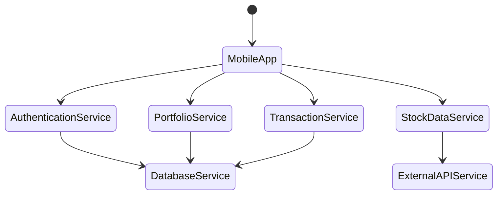
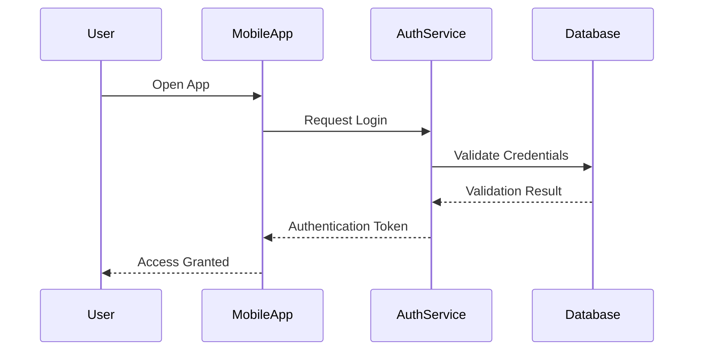
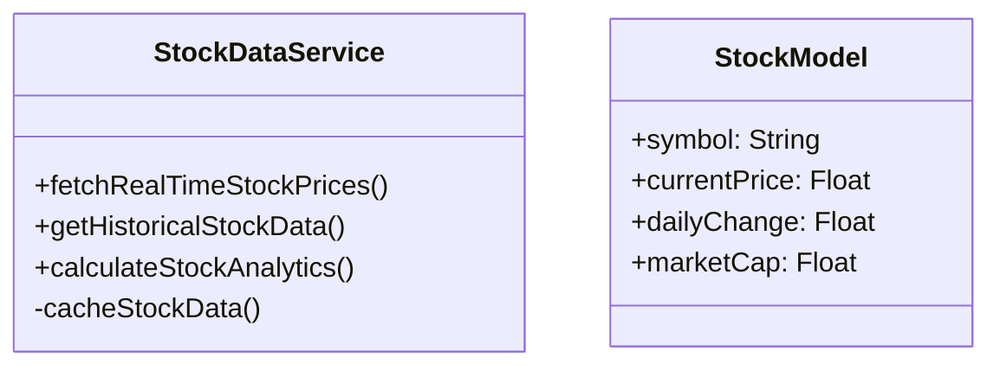
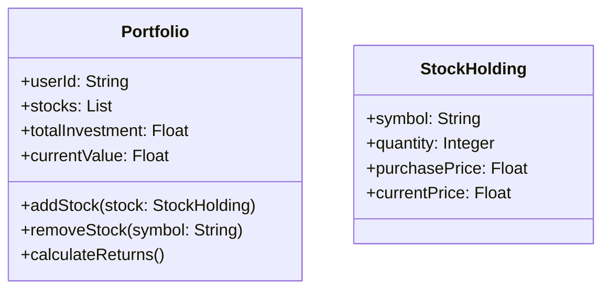

# Groww Competitor - Software Design Document

## 1. Introduction

### 1.1 Purpose
This document provides a comprehensive software design specification for the Groww Competitor, detailing the architectural design, system components, interfaces, and design considerations.

### 1.2 Scope
The Groww Competitor is a mobile application designed to facilitate stock trading, portfolio management, and investment tracking for users.

### 1.3 Design Principles
- Modular Architecture
- Separation of Concerns
- Scalability
- Security
- Performance Optimization
- User-Centric Design

## 2. System Architecture

### 2.1 High-Level Architecture

The system consists of three main layers:

1. **Frontend:** Provides a user-friendly interface for portfolio management and financial tracking.
2. **Backend:** Handles business logic, processes user requests, and connects the frontend with the database.
3. **Database:** Stores user data, transaction records, and market information.

### 2.2 Architectural Overview

### 2.3 Architectural Components
1. **Mobile Application Layer**
   - Responsible for user interface and interaction
   - Implemented using React Native for cross-platform compatibility

2. **Service Layer**
   - Authentication Service
   - Stock Data Service
   - Portfolio Management Service
   - Transaction Service

3. **Data Layer**
   - Firebase Realtime Database
   - Secure cloud storage for user data

4. **External Integrations**
   - Stock market data APIs
   - Payment gateways

## 3. Detailed Component Design

### 3.1 Authentication Component

#### Key Features
- Multi-factor authentication
- OAuth integration
- Secure token-based authentication
- Password reset functionality

### 3.2 Stock Data Service

#### Responsibilities
- Real-time stock price retrieval
- Historical data analysis
- Market trend prediction
- Performance tracking

### 3.3 Portfolio Management

## 4. User Interface Design Principles

### 4.1 Design Guidelines
- Minimalist and intuitive interface
- Consistent color scheme and typography
- Responsive design
- Accessibility considerations

### 4.2 Key Screens
- Login/Registration
- Dashboard
- Stock Trading Interface
- Portfolio Overview
- Transaction History
- Profile Management

## 5. Security Considerations

### 5.1 Security Layers
- End-to-end encryption
- Secure authentication mechanisms
- Regular security audits
- Data anonymization
- Compliance with financial regulations

### 5.2 Data Protection
- Encrypted storage of sensitive information
- Secure API communication
- Regular backup and recovery mechanisms

## 6. Performance Optimization

### 6.1 Optimization Strategies
- Caching mechanisms
- Efficient database queries
- Lazy loading of resources
- Minimized network calls
- Background data synchronization

## 7. Error Handling and Logging

### 7.1 Error Management
- Comprehensive error tracking
- User-friendly error messages
- Detailed logging for debugging
- Automatic error reporting

## 8. Deployment Strategy

### 8.1 Deployment Platforms
- iOS App Store
- Google Play Store
- Web Application (Optional)

### 8.2 Continuous Integration/Continuous Deployment (CI/CD)
- Automated testing
- Staged rollout
- Feature flags
- Version management

## Revision History
- Version 1.0: Initial Design Document
- Date: 1 December 2024
- Author: Groww Team
