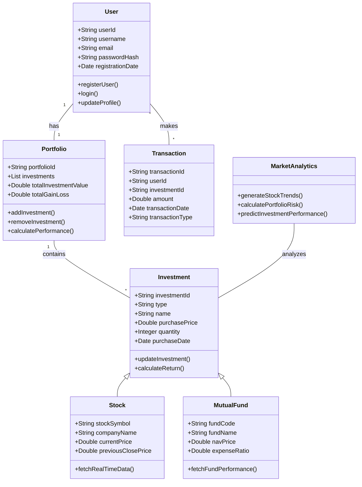
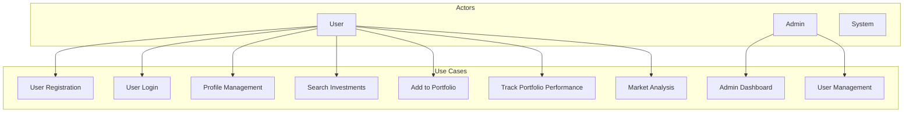
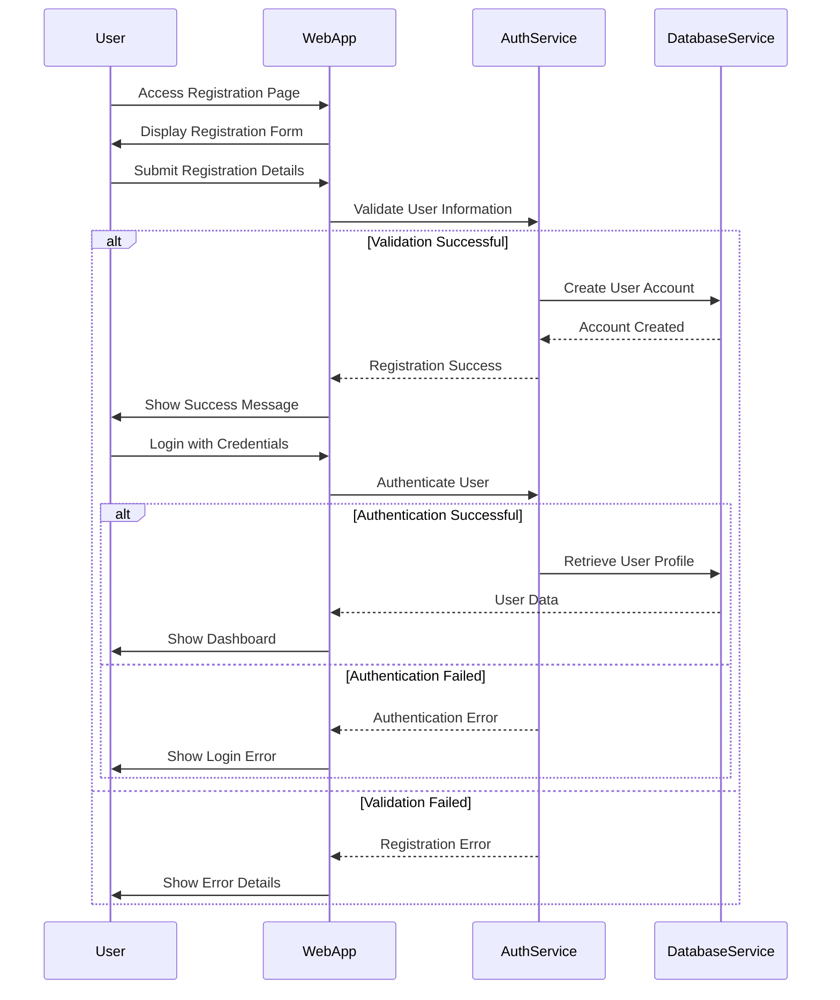
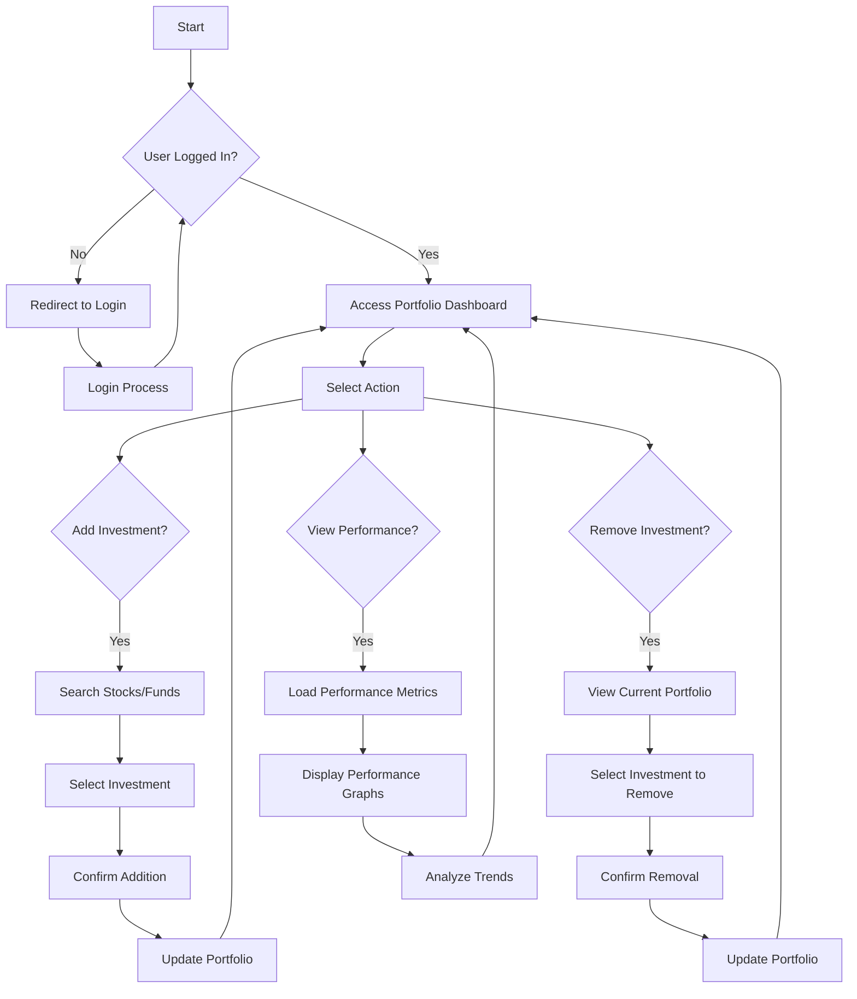
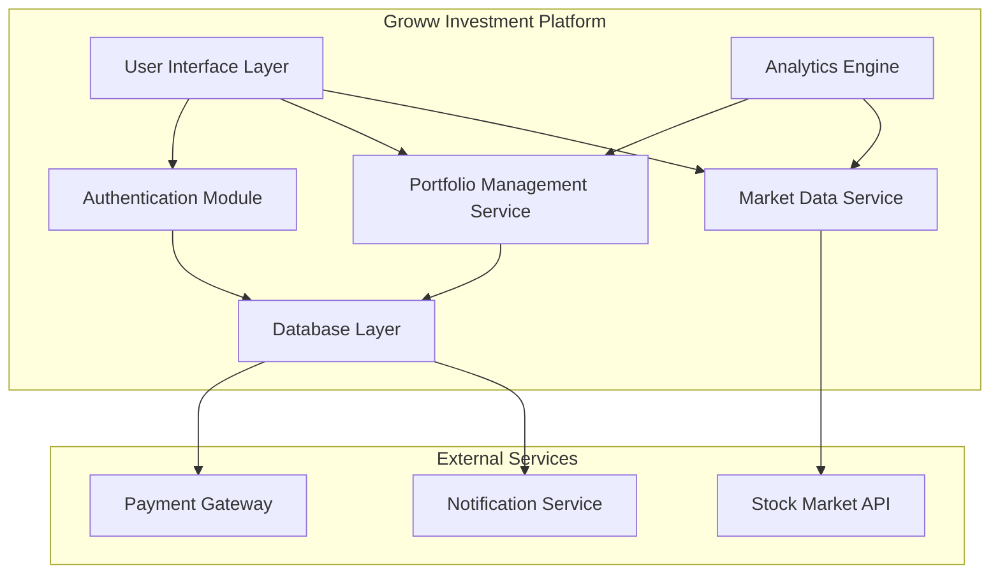
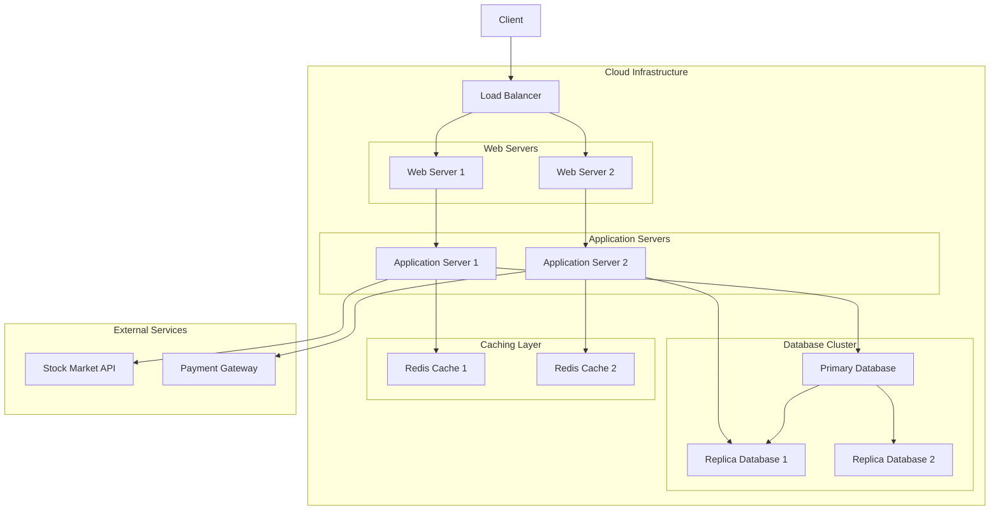
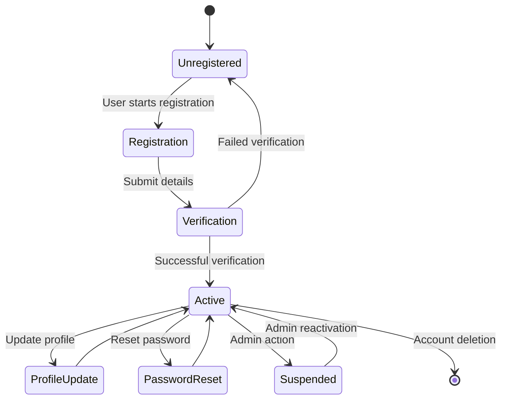
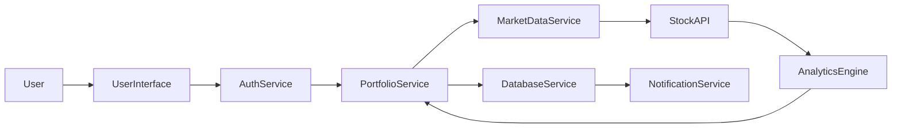

# Software Design Diagrams
## Groww Competitor Investment Platform

## 1. Class Diagram

## 2. Use Case Diagram

## 3. Sequence Diagram: User Authentication

## 4. Activity Diagram: Portfolio Management

## 5. Component Diagram

## 6. Deployment Diagram

## 7. State Diagram: User Account

## 8. Communication Diagram: Investment Process

## Conclusion
These comprehensive UML and architectural diagrams provide a holistic view of the Groww Investment Platform's design, showcasing its structure, interactions, and system architecture.

### Diagram Types Covered
1. Class Diagram
2. Use Case Diagram
3. Sequence Diagram
4. Activity Diagram
5. Component Diagram
6. Deployment Diagram
7. State Diagram
8. Communication Diagram

Each diagram offers unique insights into different aspects of the platform's design and functionality.
