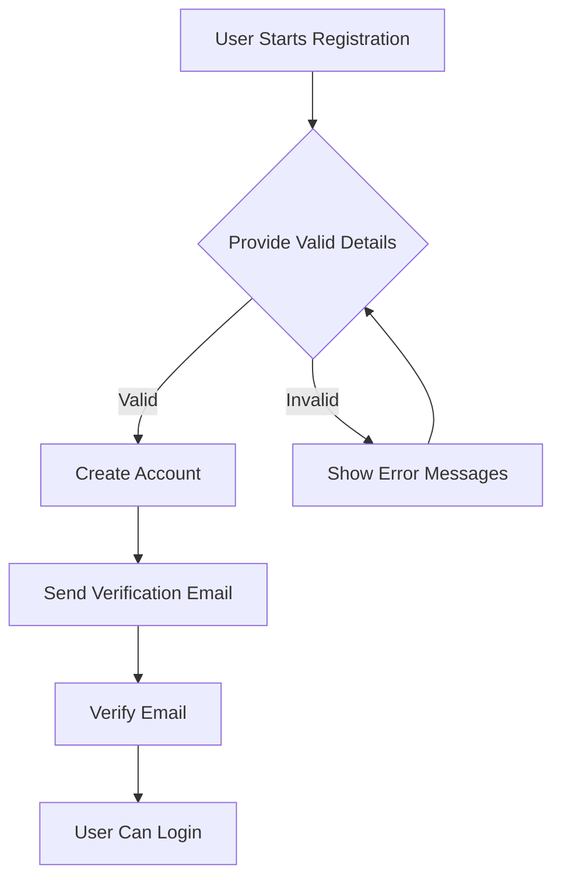
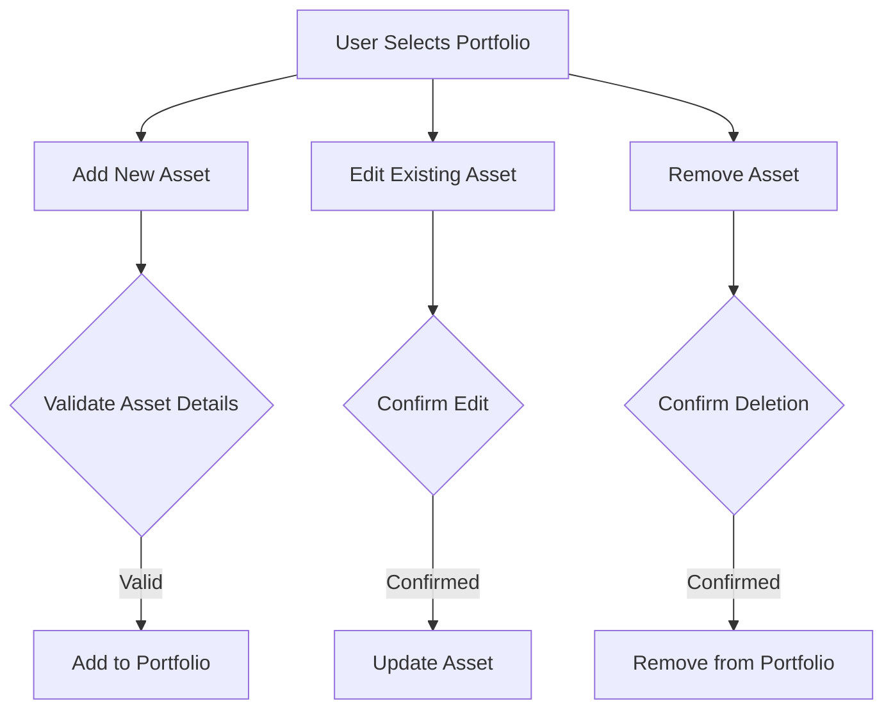
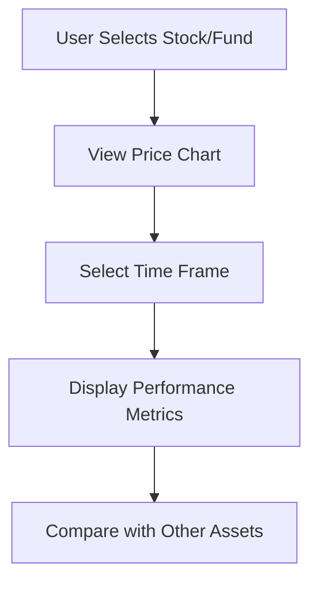
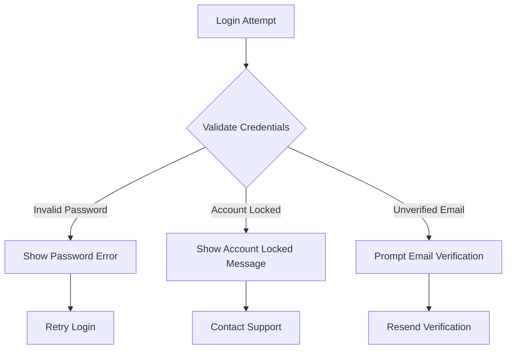
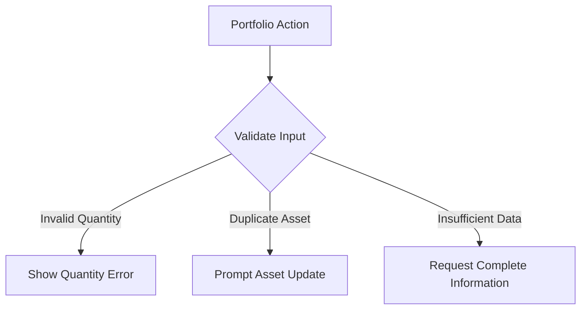
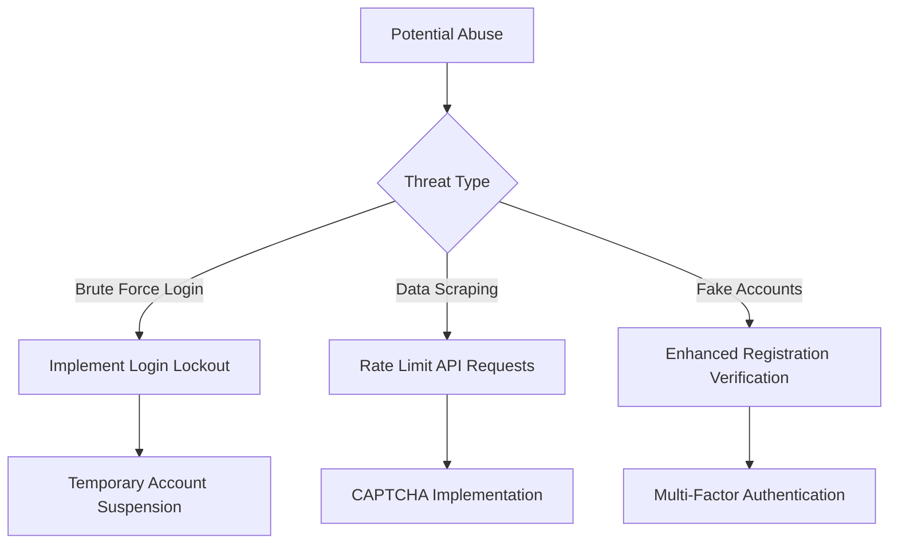

# Software Requirements Specification (SRS) - Groww Competitor

## 1. **Introduction**

This Software Requirements Specification (SRS) document details the requirements for the Groww Competitor project. The project aims to replicate the core functionality of the popular investment platform, Groww, with the ability to track investments, manage portfolios, and visualize market data. It emphasizes user-friendly design, security, and performance. The system will not allow real trading but instead focus on simulating the experience for educational purposes.

The primary audience for this document includes developers, project managers, and stakeholders who are involved in the development and deployment of the Groww Clone platform.

  

---

## 2. **Scope**

The Groww Competitor is designed to provide users with a platform where they can:

- Track their stock and mutual fund investments.
- Create and manage a personal portfolio.
- Visualize historical and real-time market data.

**Limitations**: The platform will not support actual transactions or real-time trading activities. It will focus solely on simulating an investment experience and is primarily for educational and informational purposes. This means users cannot make actual financial investments but can track hypothetical investments.

**Key Features:**

- User authentication for a secure login experience.
- An intuitive search feature for stocks and mutual funds.
- Portfolio management, allowing users to add, edit, or remove assets.
- Mobile and web compatibility for accessibility on multiple devices.

  

-----

## 3. **Functional Requirements**

### 3.1 **User Authentication**

- **Description**: Users must be able to create accounts, log in, and log out securely.
- **Features**:
  - Registration requires users to provide details i.e name, email, and password.
  - Login is protected with encryption (e.g., bcrypt) to ensure data security.
  - Password recovery and reset functionality must be available.
  - Multi-factor authentication (MFA) should be implemented for additional security.
  - OAuth-based social login options (e.g., Google or Facebook) to simplify user access.

### 3.2 **Search Functionality**

- **Description**: Users should be able to search for stocks and mutual funds quickly and efficiently.
- **Features**:
  - A real-time search bar that displays relevant suggestions as users type.
  - Search filters should allow users to filter based on categories like sector, market capitalization, etc.
  - Integration with external APIs (e.g., financial data providers) to pull accurate stock/mutual fund data.

### 3.3 **Portfolio Management**

- **Description**: Users can manage their investments by adding, editing, or removing stocks and mutual funds in their portfolio.
- **Features**:
  - An intuitive interface that allows users to:
    - Add new assets by specifying details like stock ticker, quantity, and purchase price.
    - Edit existing assets by modifying the quantity or cost price.
    - Remove assets from the portfolio.
  - Provide users with an overview of their portfolio’s performance, including gains/losses.
  - Display alerts or notifications when significant market changes occur.

### 3.4 **Market Data Visualization**

- **Description**: The platform will display stock and mutual fund market data, including historical trends and current performance.
- **Features**:
  - Charts and graphs showing stock price trends, performance indicators, and historical data.
  - Different time frames for analysis (e.g., daily, weekly, monthly, yearly).
  - Integration with financial data providers to retrieve and display real-time data.
  - Users can compare the performance of different stocks and funds.

### 3.5 **Mobile Support**

- **Description**: The platform must function seamlessly on mobile devices as well as on desktops.
- **Features**:
  - The design should be responsive, ensuring proper functionality on a variety of screen sizes (desktop, tablet, mobile).
  - Both web-based and native mobile app versions (for iOS and Android) should be supported.
  - Mobile interactions (such as touch-based gestures) should be optimized for usability.

  
  

---

## 4. **Use Cases**

### 4.1 **User Registration and Authentication**

#### Use Case: User Registration
- **Primary Actor**: New User
- **Preconditions**: User has a valid email address
- **Main Flow**:
  1. User navigates to registration page
  2. User enters personal details (name, email, password)
  3. System validates input
  4. System creates user account
  5. System sends verification email
  6. User verifies email
  7. User can now log in

#### Use Case: User Login
- **Primary Actor**: Registered User
- **Preconditions**: User has a verified account
- **Main Flow**:
  1. User enters email and password
  2. System validates credentials
  3. System generates authentication token
  4. User is redirected to dashboard

### 4.2 **Portfolio Management**

#### Use Case: Add Investment
- **Primary Actor**: Logged-in User
- **Preconditions**: User is authenticated
- **Main Flow**:
  1. User searches for stock/mutual fund
  2. User enters investment details
  3. System validates details
  4. Asset added to portfolio
  5. Portfolio performance updated

### 4.3 **Market Data Visualization**

## 5. **Error Cases and Handling**

### 5.1 **Authentication Errors**

### 5.2 **Portfolio Management Errors**

## 6. **Abuse Cases and Mitigation**

### 6.1 **Potential Security Threats**

#### Abuse Case Mitigation Strategies
1. **Brute Force Prevention**:
   - Implement login attempt limits
   - Temporary account lockout
   - Progressive delay between login attempts

2. **Data Scraping Protection**:
   - Implement API rate limiting
   - Use CAPTCHA for automated request detection
   - Implement user-agent validation

3. **Fake Account Prevention**:
   - Email verification
   - Phone number verification
   - Machine learning-based account risk scoring

## 7. **Non-Functional Requirements (NFRs)**

### 7.1 **Performance**

- **Description**: The application should provide a fast and smooth user experience.
- **Requirements**:
  - The application should load the dashboard and core functionality within 2-3 seconds under typical conditions.
  - Server response time should be optimized using caching and efficient queries.
  - The system should maintain responsiveness even under heavy user load, such as during peak market hours.

### 7.2 **Security**

- **Description**: The system must ensure that all user data is securely stored and transmitted.
- **Requirements**:
  - All user information, including personal data and portfolio details, should be encrypted both in transit (using TLS/SSL) and at rest (AES encryption).
  - Secure authentication protocols should be in place, including OAuth 2.0 for third-party logins and JWT (JSON Web Tokens) for session management.
  - Regular security audits and vulnerability testing should be conducted to ensure protection against data breaches.
  - Implement strong password policies and account lockout after multiple failed login attempts.

### 7.3 **Usability**

- **Description**: The application must be designed to be intuitive and easy to use, minimizing the learning curve for users.
- **Requirements**:
  - The UI should be clean, modern, and require minimal training for end-users to navigate and use the platform.
  - The portfolio management system should be self-explanatory, with tooltips and help icons to guide users.
  - Error messages and prompts should be informative, helping users recover from mistakes easily.
  - Conduct usability testing with a small group of users to identify potential areas of improvement.

### 7.4 **Scalability**

- **Description**: The system must be able to scale to accommodate a growing user base without degradation in performance.
- **Requirements**:
  - The system should be designed to handle up to 1 million users without significant performance bottlenecks.
  - Implement horizontal scaling for servers, ensuring that additional instances can be added to handle increased loads.
  - Use load balancers to distribute user traffic evenly across servers.
  - Optimize database queries and introduce caching mechanisms (e.g., Redis, Memcached) to reduce server load.

### 7.5 **Reliability**

- **Description**: The system must ensure high availability and consistent uptime for users.
- **Requirements**:
  - The system should have a 99.9% uptime, allowing a maximum downtime of only 1 hour per month.
  - Failover systems should be implemented to automatically switch to backup servers in the event of a failure.
  - Database backups should be conducted regularly to prevent data loss.
  - Automated health checks should monitor system components, and alert notifications should be sent out when issues arise.

  

---

This detailed SRS outlines the key components of the Groww Clone project, providing both functional and non-functional requirements to guide the development process. Each requirement ensures the application is secure, fast, scalable, and user-friendly.
