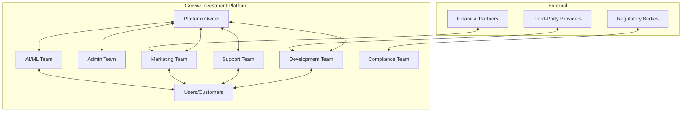
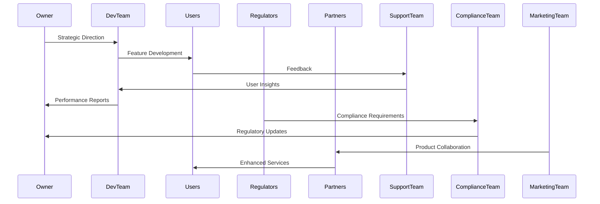

# Stakeholder Management Strategy
## Groww Investment Platform

### 1. Executive Summary
This Stakeholder Management Strategy provides a comprehensive framework for identifying, analyzing, and engaging with key stakeholders of the Groww Investment Platform. By understanding and effectively managing stakeholder relationships, we aim to ensure project success, alignment of objectives, and sustainable growth.

### 2. Stakeholder Ecosystem Analysis

#### 2.1 Stakeholder Classification
We categorize stakeholders into three primary tiers:

1. **Primary Stakeholders**
   - Direct users and decision-makers
   - Critical to platform success
   - High engagement and influence

2. **Supporting Stakeholders**
   - Provide essential services and infrastructure
   - Indirect but crucial for platform operations

3. **Regulatory Stakeholders**
   - Ensure compliance and legal adherence
   - Provide oversight and governance

### 3. Detailed Stakeholder Profiles

#### 3.1 Internal Stakeholders

| Stakeholder | Primary Responsibilities | Key Objectives | Engagement Strategy |
|-------------|-------------------------|---------------|---------------------|
| Platform Owner | Strategic vision, overall governance | Sustainable growth, profitability | Monthly strategic reviews, comprehensive reporting |
| Development Team | Technical implementation, innovation | Platform reliability, feature development | Agile sprint reviews, continuous integration |
| Admin Team | Operational management, user moderation | Smooth platform operations | Weekly operational meetings, performance dashboards |
| Support Team | User issue resolution, satisfaction | High customer retention | Real-time feedback loops, customer satisfaction metrics |
| Financial Team | Financial planning, transaction management | Financial stability, revenue optimization | Quarterly financial reviews, risk assessment |
| Marketing Team | User acquisition, brand positioning | User growth, market expansion | Bi-weekly marketing performance analysis |
| AI/ML Team | Advanced analytics, personalization | Enhanced user experience | Regular algorithm review, performance tracking |

#### 3.2 External Stakeholders

| Stakeholder | Primary Responsibilities | Interaction Frequency | Communication Channel |
|-------------|-------------------------|----------------------|----------------------|
| Customers | Investment management, platform utilization | Continuous | In-app notifications, email, customer support |
| Regulatory Bodies | Compliance monitoring | Quarterly | Formal reports, audit presentations |
| Third-Party Providers | Technical infrastructure, services | Monthly | Service level agreements, performance reviews |
| Financial Institutions | Product integration, partnership | Quarterly | Strategic partnership meetings |
| Beta Testers | Product refinement, feedback | Periodic | Dedicated feedback platforms, surveys |

### 4. Stakeholder Engagement Framework

#### 4.1 Engagement Principles
- **Transparency**: Open and honest communication
- **Inclusivity**: Representative participation
- **Responsiveness**: Timely and effective feedback mechanisms
- **Mutual Value Creation**: Win-win collaboration strategies

#### 4.2 Communication Strategy
- **Formal Channels**: Structured meetings, reports
- **Informal Channels**: Collaborative platforms, feedback sessions
- **Digital Channels**: Dedicated stakeholder portals, real-time dashboards

### 5. Risk and Mitigation Strategies

#### 5.1 Stakeholder Risk Matrix

| Risk Category | Potential Impact | Mitigation Strategy |
|--------------|-----------------|---------------------|
| Misalignment of Objectives | Project Derailment | Regular alignment workshops |
| Communication Breakdown | Operational Inefficiency | Structured communication protocols |
| Regulatory Non-Compliance | Legal Consequences | Continuous compliance training |
| Technology Disruption | Competitive Disadvantage | Ongoing innovation and skill development |

## UML Diagrams

### Stakeholder Interaction Diagram

### Stakeholder Communication Flow

### Conclusion
This comprehensive Stakeholder Management Strategy provides a structured approach to managing diverse stakeholder relationships, ensuring alignment, transparency, and sustainable growth for the Groww Investment Platform.

### Version Control
- **Version**: 1.0
- **Last Updated**: 11 December 2024
- **Next Review**: 21 June 2025
