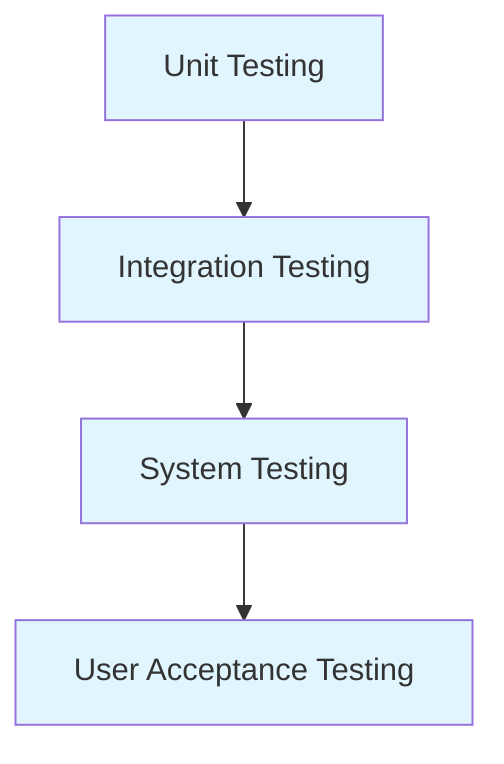
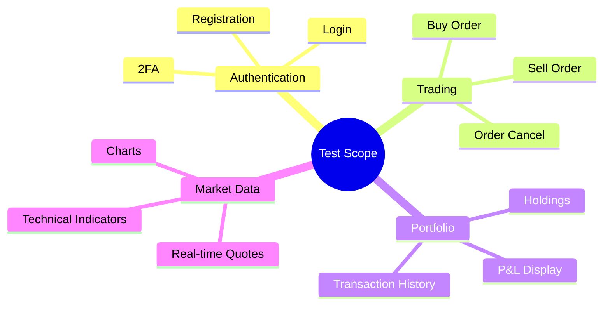
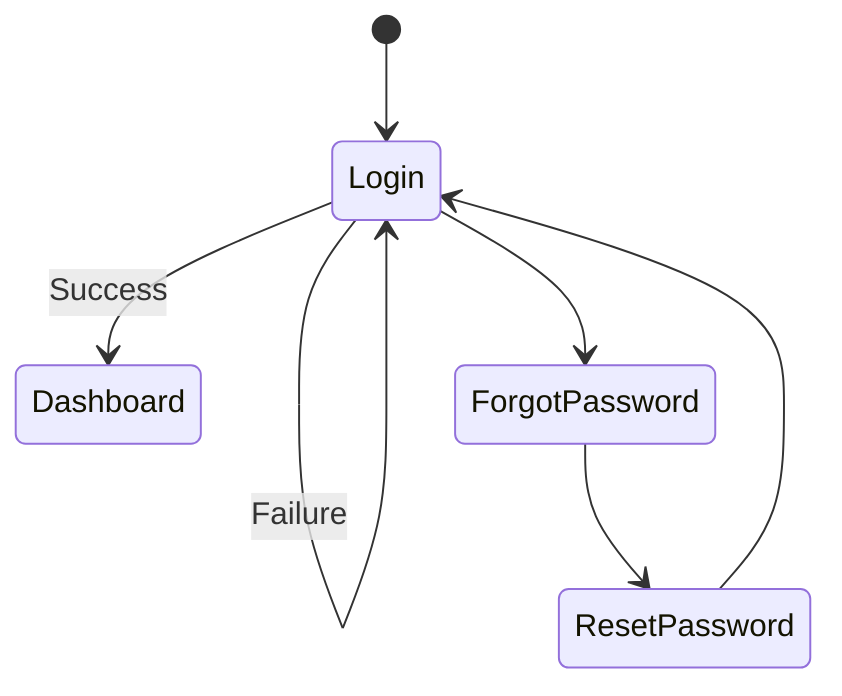
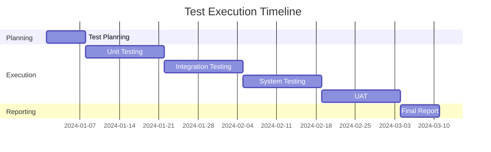

# Software Test Documentation
## Groww Trading Platform
### IEEE 829-2008 Test Documentation Format

## 1. Test Plan Identifier
GTP-TP-2024-001

## 2. References
- IEEE 829-2008 Standard for Software Test Documentation
- Groww Trading Platform Requirements Specification
- Groww Trading Platform Design Documentation

## 3. Introduction
### 3.1 System Overview
The Groww Trading Platform is a web-based trading application that allows users to:
- Execute stock trades
- Monitor market movements
- Manage investment portfolio
- Track order history
- Analyze market data

### 3.2 Test Overview

## 4. Test Items
### 4.1 Software Items
1. User Authentication Module
2. Trading Engine
3. Portfolio Management System
4. Market Data Integration
5. Order Processing System
6. Payment Gateway Integration

### 4.2 Features to be Tested

## 5. Testing Strategy
### 5.1 Unit Testing
- Framework: JUnit 5
- Scope: Individual components and methods
- Coverage Target: 85%

### 5.2 Integration Testing
- Approach: Bottom-up integration
- Focus Areas:
  - API Integration
  - Database Operations
  - Third-party Service Integration

### 5.3 System Testing
- End-to-end workflows
- Performance testing
- Security testing
- Browser compatibility

### 5.4 User Acceptance Testing
- Test environment setup
- User scenario validation
- Business requirement verification

## 6. Test Environment
### 6.1 Hardware
- Server Requirements
  - CPU: 8+ cores
  - RAM: 32GB
  - Storage: 512GB SSD

### 6.2 Software
- Operating System: Ubuntu 20.04 LTS
- Database: PostgreSQL 13
- Web Server: Nginx
- Application Server: Spring Boot
- Browser Support: Chrome, Firefox, Safari

## 7. Test Cases
### 7.1 Authentication Module

#### TC-AUTH-001: User Login
- **Objective**: Verify user login functionality
- **Preconditions**: User account exists
- **Test Steps**:
  1. Navigate to login page
  2. Enter credentials
  3. Submit form
- **Expected Results**: Successful login with redirect to dashboard
- **Pass/Fail Criteria**: User authentication and session creation

### 7.2 Trading Module
#### TC-TRADE-001: Place Buy Order
- **Objective**: Verify buy order execution
- **Preconditions**: User logged in, sufficient funds
- **Test Steps**:
  1. Select stock
  2. Enter quantity
  3. Confirm order
- **Expected Results**: Order placed successfully
- **Pass/Fail Criteria**: Order creation and fund deduction

## 8. Test Schedule
### 8.1 Timeline
1. Unit Testing: Week 1-2
2. Integration Testing: Week 3-4
3. System Testing: Week 5-6
4. UAT: Week 7-8

### 8.2 Milestones

## 9. Risks and Contingencies
### 9.1 Identified Risks
1. Integration issues with market data providers
2. Performance bottlenecks during high trading volume
3. Security vulnerabilities in payment processing
4. Browser compatibility issues

### 9.2 Mitigation Strategies
1. Backup data providers setup
2. Load testing and performance optimization
3. Regular security audits
4. Cross-browser testing automation

## 10. Staffing and Training
### 10.1 Roles and Responsibilities
- Test Manager
- Test Lead
- Test Engineers
- Automation Engineers
- Performance Testers

### 10.2 Training Requirements
- Testing tools and frameworks
- Domain knowledge
- Security testing
- Performance testing tools

## 11. Approvals
- Project Manager: ________________
- Test Manager: ________________
- Quality Assurance Lead: ________________
- Development Lead: ________________

Date: ________________
