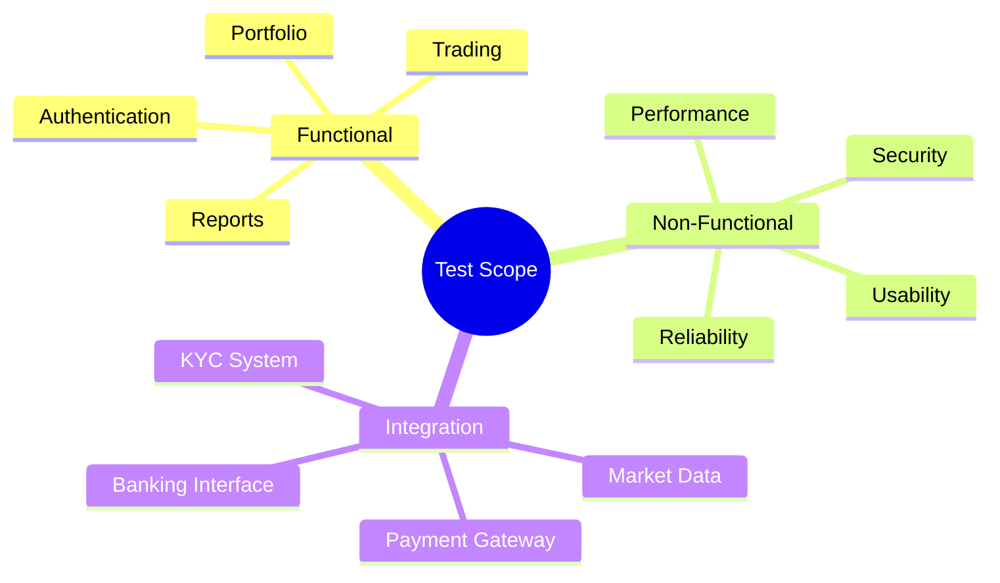
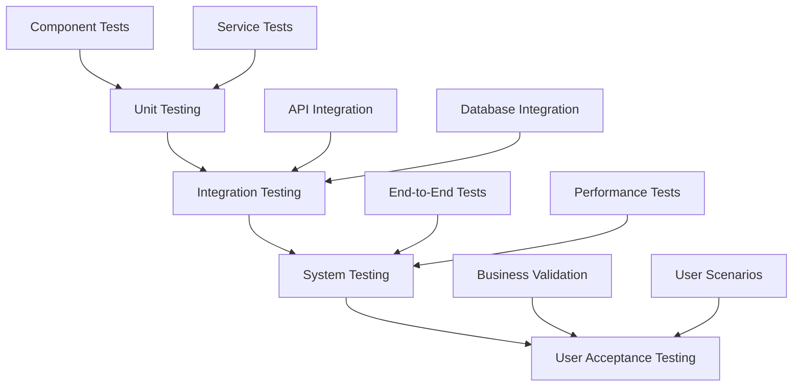
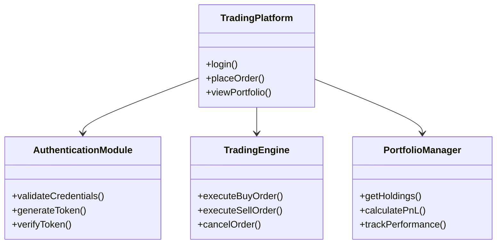
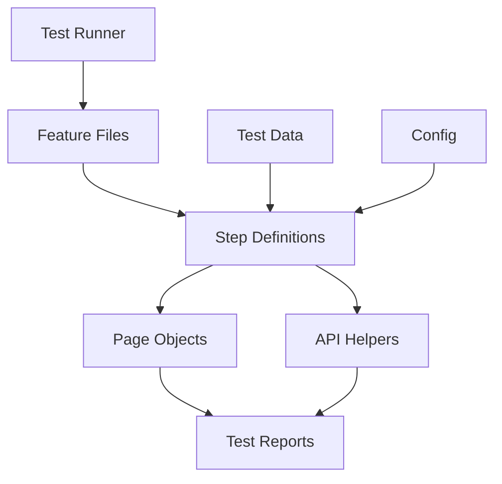
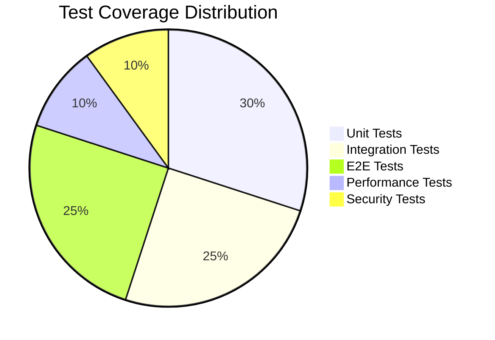
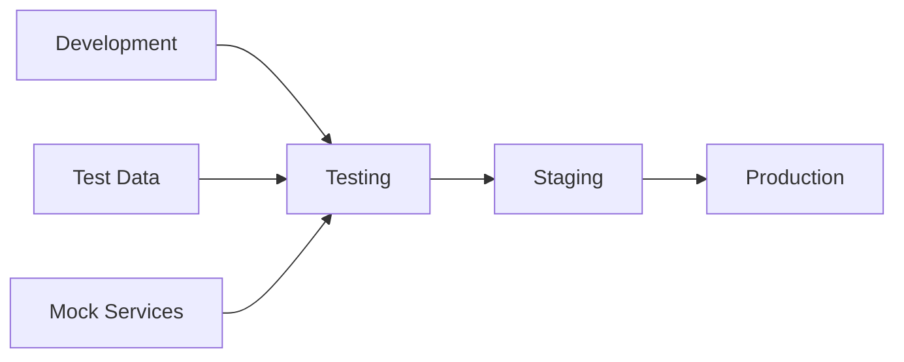
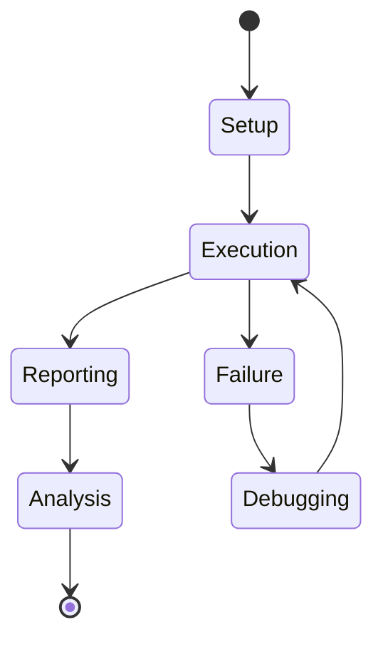
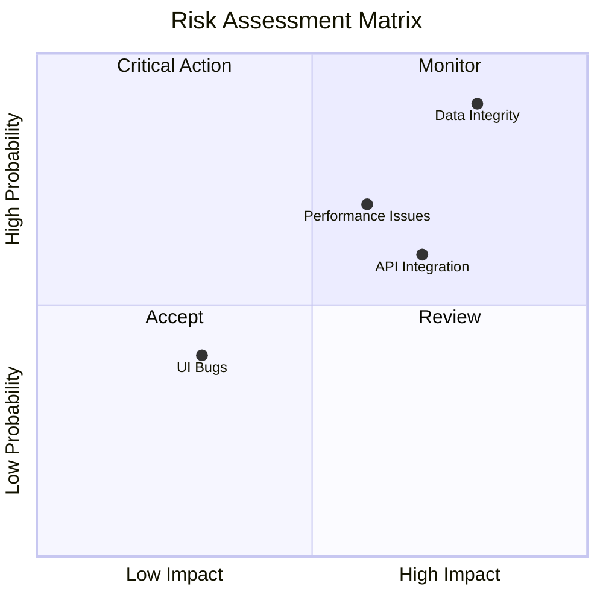
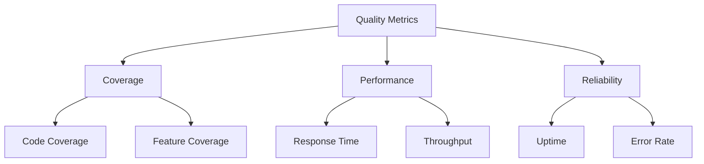
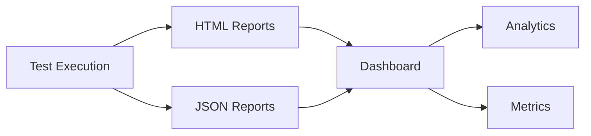

# Comprehensive Test Documentation
## Groww Competitor Investment Platform
Version 1.0 | December 2024

## Table of Contents
1. [Test Plan Overview](#1-test-plan-overview)
2. [Test Strategy](#2-test-strategy)
3. [System Architecture](#3-system-architecture)
4. [Requirements Traceability](#4-requirements-traceability)
5. [BDD Test Specifications](#5-bdd-test-specifications)
6. [Test Implementation](#6-test-implementation)
7. [Test Environment](#7-test-environment)
8. [Test Execution](#8-test-execution)
9. [Risk Analysis](#9-risk-analysis)
10. [Quality Metrics](#10-quality-metrics)
11. [Reporting](#11-reporting)
12. [Sign-off](#12-sign-off)

## 1. Test Plan Overview

### 1.1 Purpose
This document outlines the comprehensive testing strategy for the Groww Competitor Trading Platform, following IEEE 829-2008 standards and incorporating BDD methodology.

### 1.2 Scope


### 1.3 Document References
- IEEE 829-2008 Standard
- Groww Platform Requirements (REQ-2024-001)
- System Architecture Document (SAD-2024-001)
- Cucumber BDD Framework Documentation
- Chai Assertion Library Documentation

## 2. Test Strategy

### 2.1 Testing Levels


### 2.2 Testing Approaches
1. Behavior Driven Development (BDD)
2. Test Driven Development (TDD)
3. Risk-Based Testing
4. Automated Testing

## 3. System Architecture

### 3.1 Component Architecture


### 3.2 Test Architecture


## 4. Requirements Traceability

### 4.1 Requirements Coverage Matrix
| Req ID | Description | Test Cases | Feature File | Status |
|--------|-------------|------------|--------------|---------|
| REQ-001 | User Login | TC-AUTH-001-003 | auth.feature | ✓ |
| REQ-002 | Buy Order | TC-TRADE-001-004 | trading.feature | ✓ |
| REQ-003 | Portfolio View | TC-PORT-001-002 | portfolio.feature | ✓ |
| REQ-004 | Market Data | TC-DATA-001-003 | market.feature | ✓ |

### 4.2 Test Coverage Model


## 5. BDD Test Specifications

### 5.1 Authentication Features
```gherkin
Feature: User Authentication
  As a trading platform user
  I want to securely log into my account
  So that I can access my trading portfolio

  Background:
    Given the trading platform is accessible
    And the database is connected

  Scenario: Successful login with valid credentials
    Given I am on the login page
    When I enter username "trader@example.com"
    And I enter password "SecurePass123!"
    Then I should be redirected to dashboard
    And I should see my account summary

  Scenario Outline: Login validation
    Given I am on the login page
    When I enter username "<username>"
    And I enter password "<password>"
    Then I should see "<message>"

    Examples:
      | username | password | message |
      | invalid@email | wrong | Invalid credentials |
      | | Pass123! | Username required |
      | user@email | | Password required |
```

### 5.2 Trading Features
```gherkin
Feature: Stock Trading
  As a trader
  I want to place stock orders
  So that I can invest in the market

  Background:
    Given I am logged in as "trader@example.com"
    And I have sufficient funds

  Scenario: Successful market buy order
    Given I am on the trading page
    When I select stock "AAPL"
    And I enter quantity "10"
    And I click "Buy" button
    Then order should be placed successfully
    And I should see order confirmation
```

## 6. Test Implementation

### 6.1 Step Definitions
```javascript
const { Given, When, Then } = require('@cucumber/cucumber');
const { expect } = require('chai');

Given('I am on the login page', async function() {
    await this.page.goto('/login');
});

When('I enter username {string}', async function(username) {
    await this.page.fill('#username', username);
});

Then('I should be redirected to dashboard', async function() {
    const url = await this.page.url();
    expect(url).to.include('/dashboard');
});
```

### 6.2 Test Configuration
```javascript
// cucumber.conf.js
module.exports = {
    default: {
        paths: ['features/*.feature'],
        require: ['steps/*.js'],
        format: ['html:reports/cucumber-report.html'],
        parallel: 2
    }
};
```

## 7. Test Environment

### 7.1 Environment Setup


### 7.2 Technical Stack
- Test Framework: Cucumber.js
- Assertion Library: Chai
- UI Automation: Playwright
- API Testing: Supertest
- Performance Testing: k6
- CI/CD: Jenkins

## 8. Test Execution

### 8.1 Test Workflow


### 8.2 Execution Commands
```bash
# Run all tests
npm run test

# Run specific features
npm run test:auth
npm run test:trading

# Generate reports
npm run test:report
```

## 9. Risk Analysis

### 9.1 Risk Matrix


## 10. Quality Metrics

### 10.1 Key Performance Indicators
- Test Coverage: 90%
- Pass Rate: 98%
- Defect Density: < 0.5 per KLOC
- Average Response Time: < 500ms

### 10.2 Metrics Dashboard


## 11. Reporting

### 11.1 Report Types
1. Test Execution Reports
2. Coverage Reports
3. Performance Reports
4. Defect Reports

### 11.2 Report Structure


## 12. Sign-off

### 12.1 Approval Matrix
| Role | Name | Signature | Date |
|------|------|-----------|------|
| Test Manager | | | |
| QA Lead | | | |
| Development Lead | | | |
| Product Owner | | | |

### 12.2 Document History
| Version | Date | Author | Changes |
|---------|------|--------|---------|
| 1.0 | 2024-12-04 | QA Team | Initial Version |
