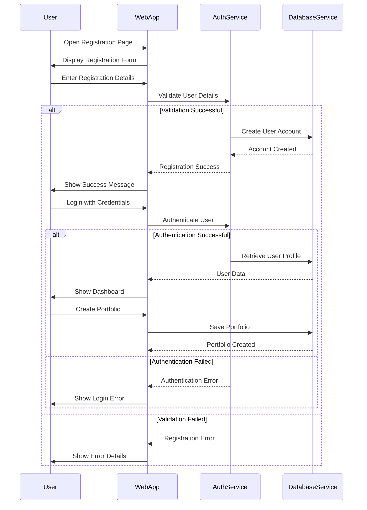
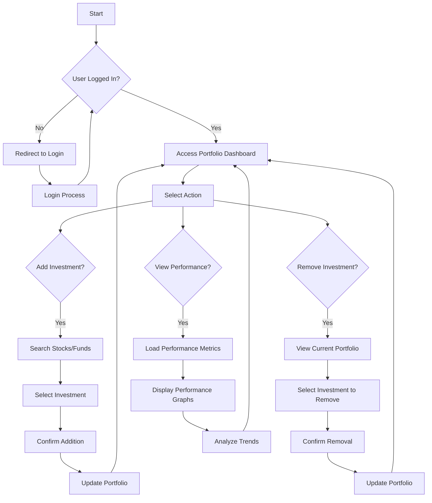
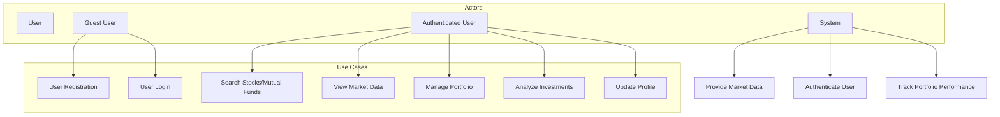

# User Requirements Document (URD)
## Groww Investment Platform

### 1. Document Purpose
This User Requirements Document (URD) defines the comprehensive user requirements for the Groww Investment Platform, detailing the functional and non-functional expectations of the application.

### 2. Project Overview
#### 2.1 Background
The Groww Investment Platform is a digital solution designed to democratize investment management, providing users with intuitive tools to track, analyze, and manage their financial portfolios.
## Sequence Diagram: User Authentication and Portfolio Creation

#### 2.2 Objectives
- Simplify investment portfolio management
- Provide real-time financial market insights
- Create an accessible platform for investors of all expertise levels

## Activity Diagram: Portfolio Management

### 3. User Requirements Specification

#### 3.1 User Authentication and Account Management
##### 3.1.1 Registration Requirements
- **Functional Requirements**:
  - Users shall be able to register using email address
  - Support for third-party authentication (Google, Facebook)
  - Implement secure password creation guidelines
  - Provide email verification process

##### 3.1.2 Login Requirements
- **Functional Requirements**:
  - Secure login mechanism with encrypted credentials
  - Option for biometric authentication (fingerprint, face recognition)
  - Implement password reset functionality
  - Two-factor authentication (2FA) option

#### 3.2 Portfolio Management
##### 3.2.1 Investment Tracking
- **Functional Requirements**:
  - Users shall add stocks and mutual funds to their portfolio
  - Ability to remove investments from portfolio
  - Real-time portfolio valuation
  - Historical performance tracking
  - Detailed breakdown of investment allocation

##### 3.2.2 Performance Analysis
- **Functional Requirements**:
  - Comprehensive portfolio performance metrics
  - Gain/loss calculations
  - Comparative performance against market benchmarks
  - Detailed investment history and transaction log

#### 3.3 Market Research and Discovery
##### 3.3.1 Stock Search and Information
- **Functional Requirements**:
  - Advanced stock search functionality
  - Detailed stock information display
    - Current price
    - Historical price trends
    - Company fundamentals
    - Key financial ratios
  - Real-time price updates

##### 3.3.2 Mutual Fund Research
- **Functional Requirements**:
  - Comprehensive mutual fund database
  - Detailed fund performance metrics
  - Fund type categorization
  - Historical performance graphs
  - Expense ratio and fund manager information

#### 3.4 Market Analysis Tools
##### 3.4.1 Visualization and Reporting
- **Functional Requirements**:
  - Interactive market trend graphs
  - Customizable chart views
  - Technical indicator overlays
  - Sector and industry performance comparisons

## Use Case Diagram

### 4. Priority Categorization

#### 4.1 High Priority Requirements
- User registration and authentication
- Portfolio creation and management
- Stock and mutual fund search functionality
- Basic portfolio performance tracking
- Core security features

#### 4.2 Medium Priority Requirements
- Advanced market analysis tools
- Performance visualization
- Detailed investment insights
- User profile customization

#### 4.3 Low Priority Requirements
- Social sharing features
- Community investment forums
- Advanced predictive analysis tools
- Third-party investment recommendations

### 5. Non-Functional Requirements

#### 5.1 Performance
- Response time < 2 seconds for most operations
- Support concurrent users without performance degradation
- Efficient data loading and caching mechanisms

#### 5.2 Security
- Compliance with financial data protection regulations
- End-to-end encryption for sensitive data
- Regular security audits
- Secure data transmission protocols

#### 5.3 Usability
- Intuitive, user-friendly interface
- Consistent design across web and mobile platforms
- Accessibility compliance
- Multilingual support

#### 5.4 Reliability
- 99.9% uptime guarantee
- Automated error logging and reporting
- Robust backup and recovery mechanisms

### 6. Constraints and Limitations
- No direct trading capabilities
- No real-time financial transactions
- Limited to informational and tracking purposes
- Dependence on external financial data providers

### 7. Future Expansion Considerations
- Machine learning-based investment recommendations
- Advanced financial education modules
- Expanded financial product offerings
- Personalized investment insights

### 8. Approval and Validation
- Requires review and approval by project stakeholders
- Subject to iterative refinement based on user feedback

## Conclusion
This User Requirements Document provides a comprehensive blueprint for the Groww Investment Platform, ensuring a clear, structured approach to developing a user-centric investment management solution.
